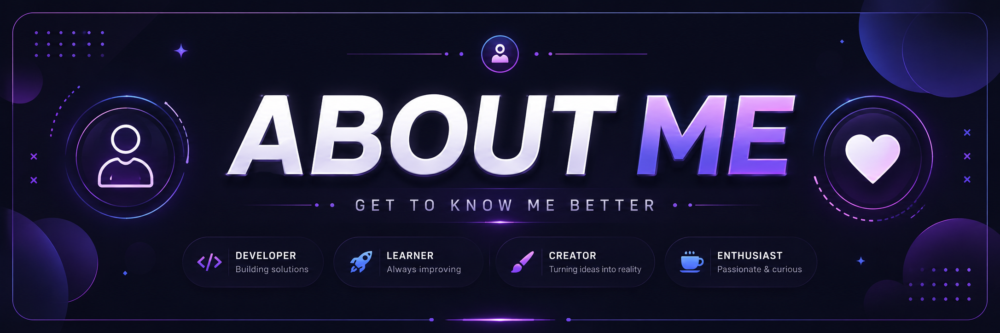
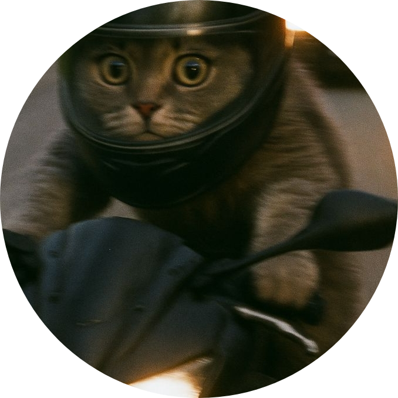
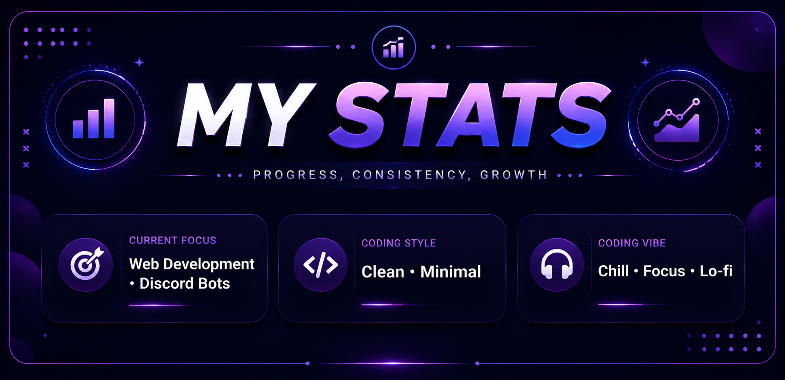
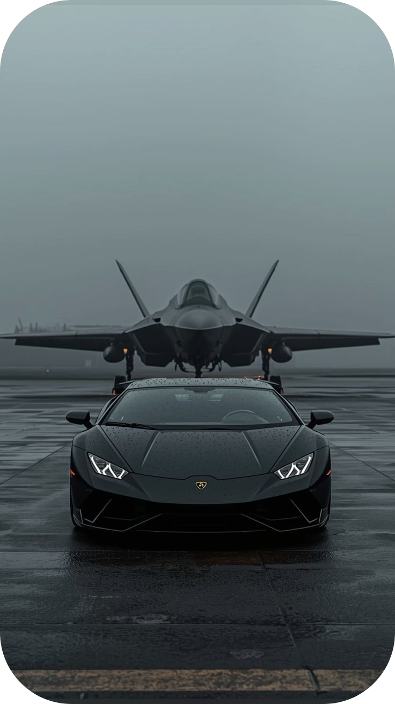
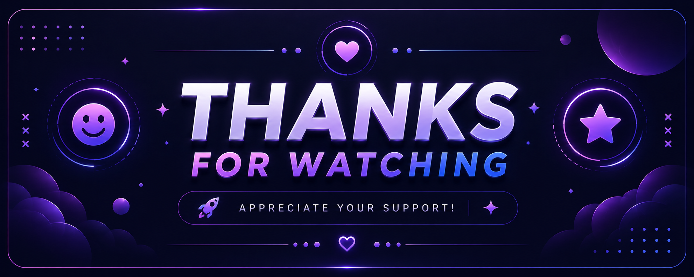

<head>
  <link rel="stylesheet" href="css/index.css">
</head>

<body>
  

  

  

    
  

  

  

    
  

  

    👋 Hi, I'm a developer from Vietnam
  

  <ul>
    <li>Gender:  Male</li>
    <li>Interests: ⚽ Football • 🎮 Gaming • 🎵 Music • 🎥 Movie</li>
    <li>Games: 
       Valorant • 
       Fo4
    </li>
    <li>💻 Tech Stack: 
    <b>Languages:</b> 
       Javascript • 
       Typescript • 
       Python • 
       php
     <b>Frontend:</b> 
       HTML • 
       CSS
       

       ReactJS • 
       VueJS • 
       Tailwind
     <b>Backend:</b> 
       Nginx • 
       HTML • 
       Express
     <b>Database:</b> 
       MySQL • 
       PostgreSQL • 
       Mongo
     <b>Software:</b> 
       Photoshop • 
       Premier • 
       After Effect
       

       Word • 
       Excel • 
       Power Point
     <b>Other:</b> 
       Git •
       Figma • 
       Canva  
  </ul>
  

  

  

  

    
  

  

  

    
  

  

  

    
  

  

  

     
  

  

  

  

  

    
  

  

  

    </a>
  

  

  

    
  

  

  

    
  

  

  

    
  

  

 

  

  

  

    
  

  

  

    
  

</body>
